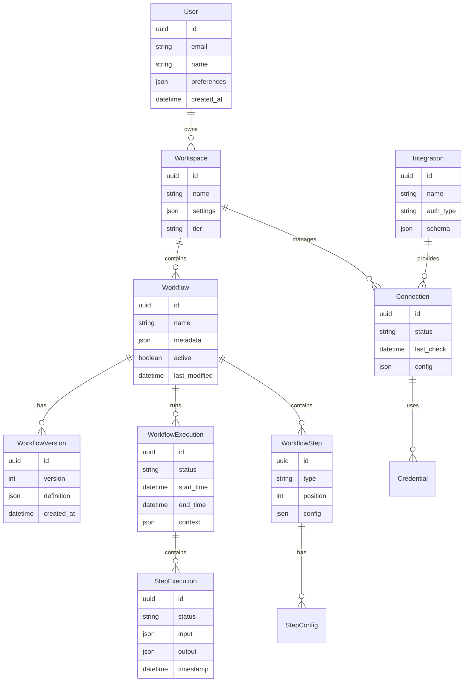

# Introduction

## Purpose

This Software Requirements Specification (SRS) document provides a comprehensive description of the Workflow Automation Platform. It details the functional and non-functional requirements for stakeholders including:

- Development and QA teams implementing the platform
- Product managers overseeing feature delivery
- System architects designing the technical infrastructure  
- Business stakeholders evaluating project scope and timeline
- Integration partners building platform connectors

## Scope

The Workflow Automation Platform is a cloud-based system that enables non-technical users to create, deploy and manage automated workflows between SaaS applications. The platform encompasses:

- Visual workflow builder for drag-and-drop automation creation
- Integration engine supporting 500+ SaaS application connections
- Scalable execution environment for reliable workflow processing
- Enterprise-grade security and compliance capabilities
- Comprehensive analytics and monitoring tools

Key benefits include:
- 90% reduction in time spent on repetitive tasks
- Elimination of manual data entry errors
- Seamless integration between business applications
- No coding required for workflow automation
- Enterprise-level security and reliability

The platform will be delivered as a multi-tenant SaaS solution with tiered pricing plans for small business, professional, and enterprise customers. Core functionality will be exposed via REST and GraphQL APIs to enable custom integrations and embedded workflow capabilities.

# Product Description

## Product Perspective
The Workflow Automation Platform operates as a cloud-native SaaS solution within the broader enterprise software ecosystem. It serves as a central integration hub between disparate business applications, positioned as a middleware layer that orchestrates data flow and process automation. The platform interfaces with:

- Cloud-based SaaS applications via their respective APIs
- On-premise systems through secure gateway connectors
- Enterprise identity providers for SSO authentication
- Cloud infrastructure providers for scalable execution
- Enterprise monitoring and logging systems

## Product Functions
- Visual Workflow Creation
  - Drag-and-drop interface for workflow design
  - Real-time validation and testing capabilities
  - Data mapping and transformation tools
  - Conditional logic and branching controls
  - Error handling and retry configuration

- Integration Management
  - Centralized connection management
  - OAuth and API key authentication
  - Real-time connection health monitoring
  - Version control for integration configurations
  - Batch processing optimization

- Workflow Execution
  - Distributed execution engine
  - Asynchronous processing
  - Parallel execution paths
  - Error handling and recovery
  - Execution history and logging

- Security and Governance
  - Role-based access control
  - Audit logging and compliance reporting
  - Data encryption at rest and in transit
  - IP restriction and network controls
  - Security policy enforcement

## User Characteristics

| User Type | Technical Expertise | Primary Use Cases |
|-----------|-------------------|------------------|
| Business Users | Low - No coding experience | Creating basic workflows, using templates |
| Process Analysts | Medium - Basic scripting knowledge | Complex workflow design, optimization |
| System Administrators | High - Technical background | Platform configuration, security management |
| Integration Developers | High - Programming expertise | Custom connector development, advanced workflows |

## Constraints
1. Technical Constraints
   - Maximum workflow execution time of 15 minutes
   - API rate limits of integrated applications
   - Data storage regulations by region
   - Browser compatibility requirements
   - Network bandwidth limitations

2. Business Constraints
   - Initial launch limited to English language
   - Pricing tiers based on execution volume
   - Support hours based on customer tier
   - Compliance requirements (SOC 2, GDPR)

3. Regulatory Constraints
   - Data residency requirements by region
   - Industry-specific compliance standards
   - Privacy law compliance (GDPR, CCPA)
   - Financial services regulations

## Assumptions and Dependencies
1. Assumptions
   - Target applications maintain stable API interfaces
   - Users have basic understanding of business processes
   - Internet connectivity is consistently available
   - Cloud infrastructure remains reliable
   - Market demand for no-code automation continues

2. Dependencies
   - Third-party API availability and performance
   - Cloud infrastructure providers
   - Identity provider services
   - SSL certificate authorities
   - Content delivery networks
   - Database management systems
   - Message queue services

# Process Flowchart

## Core Platform Flow

## Integration Authentication Flow

## Workflow Execution Flow

# Functional Requirements

## F1: Visual Workflow Builder

### ID: WB-001
### Description
Core drag-and-drop interface enabling users to visually create and edit automated workflows
### Priority: P0 (Critical)

| Requirement ID | Description | Acceptance Criteria |
|---------------|-------------|-------------------|
| WB-001.1 | Drag-and-drop interface for workflow steps | - Smooth drag operation of components - Visual feedback during drag - Snap-to-grid placement |
| WB-001.2 | Real-time workflow validation | - Immediate feedback on invalid connections - Clear error messaging - Suggested fixes displayed |
| WB-001.3 | Data mapping interface | - Visual field mapping between steps - Support for data transformations - Preview of mapped data |
| WB-001.4 | Conditional logic builder | - Visual branching paths - Condition builder interface - Support for AND/OR operations |
| WB-001.5 | Error handling configuration | - Retry settings configuration - Error notification setup - Fallback path definition |

## F2: Integration Management

### ID: IM-001
### Description
System for managing connections and authentication with external applications
### Priority: P0 (Critical)

| Requirement ID | Description | Acceptance Criteria |
|---------------|-------------|-------------------|
| IM-001.1 | OAuth authentication flow | - Secure token management - Automatic token refresh - Connection status monitoring |
| IM-001.2 | API key management | - Encrypted storage - Key rotation support - Access audit logging |
| IM-001.3 | Connection health monitoring | - Real-time status checks - Automated alerts - Health history tracking |
| IM-001.4 | Rate limit management | - Dynamic rate limiting - Queue management - Throttling controls |
| IM-001.5 | Version control | - Config version history - Rollback capability - Change tracking |

## F3: Workflow Execution Engine

### ID: EX-001
### Description
Distributed system for reliable workflow processing and monitoring
### Priority: P0 (Critical)

| Requirement ID | Description | Acceptance Criteria |
|---------------|-------------|-------------------|
| EX-001.1 | Asynchronous processing | - Queue-based execution - Parallel processing support - Resource management |
| EX-001.2 | Error recovery | - Automatic retry logic - Circuit breaker implementation - Error notification system |
| EX-001.3 | Execution logging | - Detailed execution history - Step-level logging - Performance metrics |
| EX-001.4 | Scalability | - Dynamic resource allocation - Load balancing - Multi-region support |
| EX-001.5 | Monitoring | - Real-time status tracking - Performance analytics - Resource utilization monitoring |

## F4: Analytics Dashboard

### ID: AN-001
### Description
Comprehensive analytics and reporting interface for workflow insights
### Priority: P1 (High)

| Requirement ID | Description | Acceptance Criteria |
|---------------|-------------|-------------------|
| AN-001.1 | Execution metrics | - Success/failure rates - Performance statistics - Trend analysis |
| AN-001.2 | Resource utilization | - CPU/memory usage - API call volumes - Cost analysis |
| AN-001.3 | Error reporting | - Error categorization - Impact analysis - Resolution tracking |
| AN-001.4 | Usage analytics | - User adoption metrics - Feature usage stats - Workflow popularity |
| AN-001.5 | Custom reporting | - Report builder interface - Export capabilities - Scheduled reports |

## F5: Security Management

### ID: SE-001
### Description
Enterprise security and compliance management system
### Priority: P0 (Critical)

| Requirement ID | Description | Acceptance Criteria |
|---------------|-------------|-------------------|
| SE-001.1 | Access control | - Role-based permissions - Custom role creation - Access audit logs |
| SE-001.2 | Data encryption | - At-rest encryption - In-transit encryption - Key management |
| SE-001.3 | Compliance reporting | - Audit trail generation - Compliance dashboard - Policy enforcement |
| SE-001.4 | Network security | - IP restriction - DDoS protection - SSL/TLS enforcement |
| SE-001.5 | Security monitoring | - Threat detection - Vulnerability scanning - Security alerts |

# Non-Functional Requirements

## Performance Requirements

| Metric | Requirement | Measurement Criteria |
|--------|------------|---------------------|
| API Response Time | < 200ms for 95th percentile | Measured at API gateway level |
| Workflow Execution Latency | < 60 seconds to start | From trigger to first step execution |
| Database Query Performance | < 100ms for 99% of queries | Measured at database level |
| UI Rendering Time | < 2 seconds for initial load | First Contentful Paint metric |
| Concurrent Workflows | Support 100,000 simultaneous executions | Under normal operating conditions |
| Resource Utilization | < 70% CPU/memory usage | During peak load periods |

## Safety Requirements

| Category | Requirement | Implementation |
|----------|------------|----------------|
| Data Backup | Hourly incremental, daily full backups | Multi-region backup storage |
| Disaster Recovery | RPO < 1 hour, RTO < 4 hours | Automated failover systems |
| Circuit Breaking | Automatic service isolation after 5 failures | Per-service circuit breakers |
| Rate Limiting | Dynamic throttling based on service health | Per-user and per-service limits |
| Data Validation | Input sanitization for all data entry points | Server-side validation |
| Failover Systems | Automatic failover to secondary region | Active-active configuration |

## Security Requirements

| Feature | Specification | Details |
|---------|--------------|---------|
| Authentication | Multi-factor authentication | TOTP, SMS, or hardware key |
| Authorization | Role-based access control (RBAC) | Granular permission system |
| Data Encryption | AES-256 at rest, TLS 1.3 in transit | HSM key management |
| Network Security | WAF, DDoS protection, IP filtering | Cloud provider security services |
| Audit Logging | Comprehensive activity logging | Immutable audit trails |
| Secrets Management | Vault-based credential storage | Automatic key rotation |

## Quality Requirements

### Availability
- 99.99% uptime guarantee
- Maximum planned downtime of 15 minutes/month
- Redundant infrastructure across multiple regions
- Automated health checks every 30 seconds

### Maintainability
- Modular architecture with microservices
- Automated deployment pipelines
- Comprehensive system documentation
- Automated testing coverage > 80%

### Usability
- Maximum 3 clicks to reach any function
- Support for keyboard shortcuts
- Consistent UI/UX patterns
- Accessibility compliance (WCAG 2.1 AA)

### Scalability
- Horizontal scaling up to 1M daily workflows
- Auto-scaling based on load metrics
- Database sharding support
- Multi-region deployment capability

### Reliability
- 99.9% workflow execution success rate
- Automatic retry mechanism for failed operations
- Data consistency checks
- Transaction integrity guarantees

## Compliance Requirements

| Standard | Requirement | Validation Method |
|----------|------------|------------------|
| SOC 2 Type II | Annual certification | External audit |
| GDPR | Data privacy compliance | Regular assessments |
| CCPA | California privacy law compliance | Self-assessment |
| ISO 27001 | Information security management | Annual certification |
| HIPAA | Healthcare data compliance | External audit |
| PCI DSS | Payment card data security | Quarterly scans |

# Data Requirements

## Data Models

## Data Storage

### Primary Storage
- PostgreSQL clusters for relational data
  - Multi-region active-passive configuration
  - Automatic failover with 99.99% availability
  - Point-in-time recovery capability
  - Automated backup every 6 hours

### Document Storage
- MongoDB clusters for workflow definitions and execution logs
  - Sharded for horizontal scalability
  - Automated backup every 4 hours
  - 30-day retention for execution history
  - Geo-distributed replica sets

### Cache Layer
- Redis clusters for temporary data and rate limiting
  - In-memory caching with persistence
  - 72-hour data retention
  - Cluster mode for high availability
  - Cross-region replication

### Object Storage
- S3-compatible storage for files and artifacts
  - Versioning enabled
  - 90-day retention policy
  - Cross-region replication
  - Lifecycle management for cost optimization

## Data Processing

### Data Security
- Encryption at rest using AES-256
- TLS 1.3 for data in transit
- Field-level encryption for sensitive data
- Key rotation every 90 days
- Data masking for non-production environments

### Data Retention
| Data Type | Retention Period | Archive Policy |
|-----------|------------------|----------------|
| Workflow Definitions | Indefinite | Yearly backup |
| Execution Logs | 30 days | 90-day archive |
| Audit Trails | 1 year | 7-year archive |
| User Data | Account lifetime | 30-day post-deletion |
| System Metrics | 90 days | 1-year archive |

### Data Compliance
| Requirement | Implementation |
|-------------|----------------|
| Data Residency | Region-specific storage |
| Data Privacy | PII identification and protection |
| Access Control | Role-based data access |
| Audit Logging | Immutable audit trails |
| Data Portability | Standardized export formats |

# External Interfaces

## User Interfaces

### Web Application Interface
- Responsive design supporting 1024x768 minimum resolution
- Support for latest versions of Chrome, Firefox, Safari, and Edge
- WCAG 2.1 AA compliance for accessibility
- Consistent design system following Material Design principles
- Maximum 3-second initial page load time

| Interface Component | Requirements |
|-------------------|--------------|
| Workflow Builder | - Canvas size minimum 800x600px - Zoom levels 50-200% - Mini-map for navigation - Grid snap functionality |
| Integration Panel | - Searchable integration directory - Categorized listing - Connection status indicators - Quick-access favorites |
| Execution Monitor | - Real-time status updates - Collapsible execution details - Timeline visualization - Error highlighting |
| Analytics Dashboard | - Responsive data visualizations - Export functionality - Customizable widgets - Interactive filters |

### Mobile Interface
- Progressive Web App (PWA) support
- Touch-optimized monitoring interface
- Execution status notifications
- Limited workflow editing capabilities
- Biometric authentication support

## Software Interfaces

### Integration APIs
| System Type | Protocol | Authentication | Data Format |
|------------|----------|----------------|-------------|
| REST APIs | HTTPS | OAuth 2.0, API Keys | JSON |
| GraphQL APIs | HTTPS | JWT | GraphQL |
| SOAP Services | HTTPS | WS-Security | XML |
| Database Systems | TLS | Certificate-based | Native protocols |
| Message Queues | AMQP/MQTT | SASL | Binary/JSON |

### External Services

| Service Type | Interface Method | Purpose |
|-------------|------------------|----------|
| Identity Providers | SAML 2.0, OIDC | Authentication |
| Email Services | SMTP/API | Notifications |
| SMS Gateways | REST API | Mobile alerts |
| Cloud Storage | S3 API | File handling |
| CDN Services | HTTPS | Asset delivery |

## Communication Interfaces

### Network Protocols
- HTTPS (TLS 1.3) for all web traffic
- WebSocket for real-time updates
- gRPC for internal service communication
- MQTT for IoT device integration
- AMQP for message queue communication

### Data Exchange Formats
| Format | Use Case | Validation |
|--------|----------|------------|
| JSON | API responses | JSON Schema |
| Protocol Buffers | Service mesh | Proto definitions |
| XML | Legacy integrations | XSD Schema |
| CSV | Bulk data export | RFC 4180 |
| JWT | Authentication tokens | RFC 7519 |

### API Gateway Requirements
- Rate limiting: 1000 requests/minute per user
- Response caching with 5-minute TTL
- Request/response logging
- API key management
- Circuit breaker implementation
- Cross-origin resource sharing (CORS)

## Hardware Interfaces

### Load Balancers
- Hardware load balancer support
- SSL termination
- Health check endpoints
- TCP/UDP protocol support
- Session persistence

### Storage Systems
| Type | Interface | Protocol |
|------|-----------|----------|
| SAN | Fiber Channel | SCSI |
| NAS | 10GbE | NFS v4 |
| DAS | SAS/SATA | Native |
| Object Storage | 10GbE | S3 |

### Network Requirements
- 10Gbps minimum network interface
- Jumbo frame support
- VLAN tagging
- QoS support
- IPv6 compatibility

# APPENDICES

## GLOSSARY

| Term | Definition |
|------|------------|
| Workflow | A sequence of automated steps that process data and perform actions between systems |
| Integration | A connection between the platform and an external application or service |
| Webhook | An HTTP callback that occurs when a specific event happens in a system |
| Circuit Breaker | A design pattern that prevents system failure by stopping operations when errors exceed thresholds |
| OAuth | An open standard authorization protocol that enables secure delegated access |
| Rate Limiting | The practice of controlling the number of API requests a user can make in a given timeframe |
| Polling | The practice of periodically checking a system for new data or changes |
| RBAC | A method of regulating access to resources based on the roles of individual users |
| Idempotency | Property where an operation can be applied multiple times without changing the result |
| Throttling | The process of controlling the rate of resource utilization or service requests |

## ACRONYMS

| Acronym | Full Form |
|---------|-----------|
| API | Application Programming Interface |
| AMQP | Advanced Message Queuing Protocol |
| CORS | Cross-Origin Resource Sharing |
| DDoS | Distributed Denial of Service |
| GDPR | General Data Protection Regulation |
| HSM | Hardware Security Module |
| JWT | JSON Web Token |
| MQTT | Message Queuing Telemetry Transport |
| OIDC | OpenID Connect |
| PWA | Progressive Web Application |
| SAML | Security Assertion Markup Language |
| SAN | Storage Area Network |
| SSL | Secure Sockets Layer |
| TLS | Transport Layer Security |
| WCAG | Web Content Accessibility Guidelines |

## ADDITIONAL REFERENCES

| Category | Reference |
|----------|-----------|
| Security Standards | - OWASP Security Guidelines - NIST Cybersecurity Framework - Cloud Security Alliance Guidelines |
| API Design | - REST API Design Rulebook - GraphQL Best Practices - API Security Best Practices |
| Performance | - Google Web Vitals - AWS Well-Architected Framework - Microservices Design Patterns |
| Compliance | - SOC 2 Compliance Guide - GDPR Implementation Guide - HIPAA Security Rule Guidelines |
| Development | - Twelve-Factor App Methodology - Cloud Native Computing Foundation - GitOps Principles |

## CHANGE LOG

| Version | Date | Changes | Author |
|---------|------|---------|---------|
| 1.0.0 | Initial | Base PRD creation | Product Team |
| 1.1.0 | | Added Integration Requirements | Architecture Team |
| 1.2.0 | | Enhanced Security Requirements | Security Team |
| 1.3.0 | | Updated Data Requirements | Data Team |
| 1.4.0 | | Added External Interfaces | Systems Team |

## ASSUMPTIONS AND DEPENDENCIES MATRIX

| Category | Assumption | Related Dependencies | Risk Level |
|----------|------------|---------------------|------------|
| Infrastructure | Cloud provider availability | AWS/GCP/Azure services | High |
| Integration | API stability | Third-party services | Medium |
| Security | Identity provider uptime | SSO providers | High |
| Performance | Network reliability | CDN services | Medium |
| Compliance | Regulatory stability | Compliance frameworks | Low |