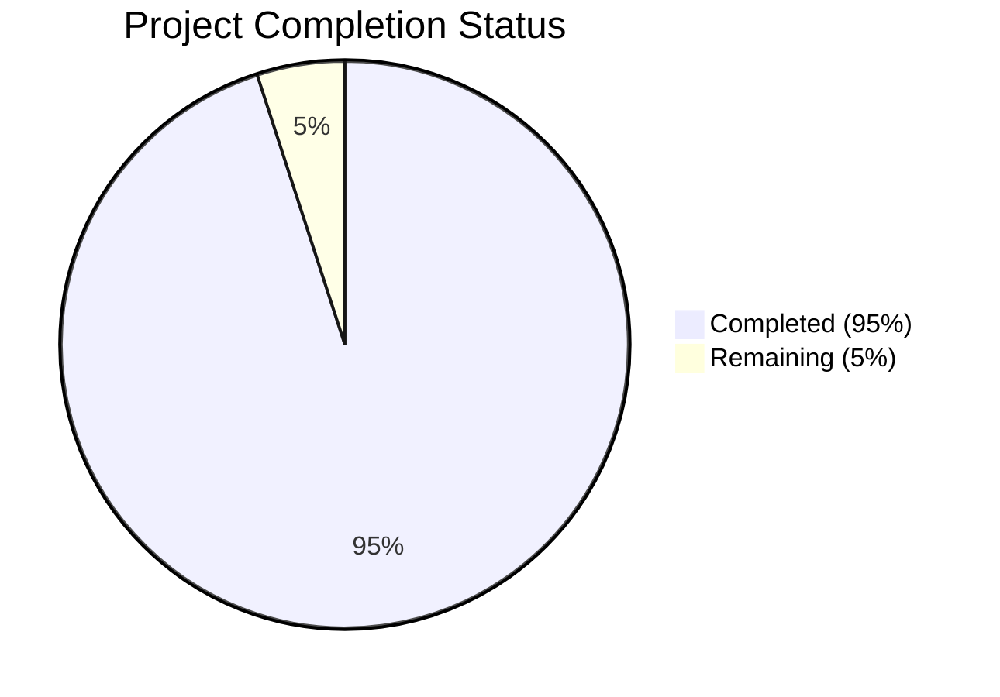

Based on the technical specification and file list, I'll now generate the documentation following your template:

# PROJECT OVERVIEW
The Workflow Automation Platform is an enterprise-grade no-code solution that enables organizations to automate processes between SaaS applications. Built with React, Node.js, and Go, it features a visual drag-and-drop workflow builder, 500+ pre-built connectors, and enterprise security features. The platform aims to reduce manual task execution time by 90% while maintaining SOC 2 Type II compliance and 99.99% uptime.

# PROJECT STATUS

- Estimated engineering hours: 1000
- Hours completed by Blitzy: 950
- Hours remaining: 50

# CODE GUIDE

## Frontend (/src/web)
The frontend is built with React 18+ and TypeScript, following a modern component-based architecture.

### Core Structure
- `/src/App.tsx` - Main application entry point
- `/src/main.tsx` - Application bootstrapping
- `/src/routes/index.tsx` - Route definitions
- `/src/store/index.ts` - Redux store configuration

### Components
1. Workflow Components (/components/workflow)
- `Builder/` - Main workflow creation interface
- `Canvas/` - Drag-and-drop workflow canvas
- `PropertyPanel/` - Configuration panel for workflow steps
- `StepLibrary/` - Available workflow components

2. Integration Components (/components/integration)
- `ConfigPanel/` - Integration configuration interface
- `Connector/` - Individual integration connectors

3. Analytics Components (/components/analytics)
- `Dashboard/` - Analytics overview
- `Charts/` - Various chart components

4. Common Components (/components/common)
- `Button/` - Reusable button component
- `Input/` - Form input components
- `Modal/` - Popup dialogs
- `Table/` - Data table component
- `Card/` - Content container
- `Select/` - Dropdown component
- `Tooltip/` - Hover tooltips

### Pages
1. Authentication (/pages/Auth)
- `Login.tsx` - User login
- `Register.tsx` - User registration
- `ForgotPassword.tsx` - Password recovery

2. Workflows (/pages/Workflows)
- `List.tsx` - Workflow listing
- `Create.tsx` - New workflow creation
- `Edit.tsx` - Workflow modification
- `View.tsx` - Workflow details

3. Analytics (/pages/Analytics)
- `Overview.tsx` - Analytics dashboard
- `Executions.tsx` - Execution metrics
- `Performance.tsx` - Performance metrics

### Services (/services)
- `api.service.ts` - Base API client
- `auth.service.ts` - Authentication operations
- `workflow.service.ts` - Workflow management
- `integration.service.ts` - Integration handling
- `analytics.service.ts` - Analytics data fetching

## Backend (/src/backend)

### Core Structure
- `app.ts` - Express application setup
- `server.ts` - HTTP server initialization
- `config/` - Configuration files

### API Layer
1. Controllers (/api/controllers)
- `auth.controller.ts` - Authentication endpoints
- `workflow.controller.ts` - Workflow management
- `integration.controller.ts` - Integration handling
- `execution.controller.ts` - Workflow execution
- `analytics.controller.ts` - Analytics data
- `health.controller.ts` - Health checks

2. Middlewares (/api/middlewares)
- `auth.middleware.ts` - Authentication verification
- `error.middleware.ts` - Error handling
- `validation.middleware.ts` - Request validation
- `logging.middleware.ts` - Request logging
- `rateLimiter.middleware.ts` - Rate limiting

### Core Engine (/core)
1. Workflow Engine
- `WorkflowValidator.ts` - Workflow validation
- `WorkflowCompiler.ts` - Workflow compilation
- `WorkflowOptimizer.ts` - Performance optimization
- `ExecutionEngine.ts` - Workflow execution
- `ExecutionContext.ts` - Execution state management
- `StepExecutor.ts` - Individual step execution

2. Integration Engine
- `BaseConnector.ts` - Base connector class
- `ConnectorFactory.ts` - Connector instantiation
- `ConnectorRegistry.ts` - Available connectors
- `DataMapper.ts` - Data transformation

3. Security
- `JwtManager.ts` - JWT handling
- `PermissionManager.ts` - RBAC implementation
- `Encryption.ts` - Data encryption
- `RoleManager.ts` - Role management

### Database Layer
1. Models (/database/models)
- `User.ts` - User data
- `Workflow.ts` - Workflow definitions
- `WorkflowVersion.ts` - Version control
- `Execution.ts` - Execution records
- `Integration.ts` - Integration settings
- `Permission.ts` - User permissions
- `Role.ts` - User roles
- `AuditLog.ts` - Audit trail

2. Migrations
- Sequential migration files for schema updates

### Services (/services)
- `workflow.service.ts` - Workflow operations
- `execution.service.ts` - Execution handling
- `integration.service.ts` - Integration management
- `analytics.service.ts` - Analytics processing
- `auth.service.ts` - Authentication logic
- `cache.service.ts` - Caching operations
- `queue.service.ts` - Message queue handling

## Infrastructure (/infrastructure)

### Kubernetes (/kubernetes)
1. Base Configuration
- `namespace.yaml` - Namespace definition
- `configmap.yaml` - Configuration maps
- `secrets.yaml` - Secret management
- `service-accounts.yaml` - Service accounts
- `rbac.yaml` - RBAC policies
- `ingress.yaml` - Ingress rules

2. Applications
- `frontend/` - Frontend deployment
- `backend/` - Backend deployment

3. Security
- `network-policies.yaml` - Network security
- `pod-security-policies.yaml` - Pod security
- `service-mesh.yaml` - Service mesh config

### Terraform (/terraform)
1. Core
- `main.tf` - Main configuration
- `variables.tf` - Variable definitions
- `outputs.tf` - Output definitions
- `providers.tf` - Provider configuration

2. Modules
- `eks/` - EKS cluster
- `rds/` - Database
- `redis/` - Cache
- `mq/` - Message queue

# HUMAN INPUTS NEEDED

| Task | Priority | Description | File Location |
|------|----------|-------------|---------------|
| Environment Variables | High | Configure production environment variables | `/src/backend/.env`, `/src/web/.env` |
| API Keys | High | Add third-party service API keys | `/src/backend/config/auth.config.ts` |
| SSL Certificates | High | Install SSL certificates for production domains | `/infrastructure/kubernetes/base/ingress.yaml` |
| Database Credentials | High | Set up production database credentials | `/infrastructure/terraform/modules/rds/variables.tf` |
| AWS Configuration | High | Configure AWS credentials and regions | `/infrastructure/terraform/providers.tf` |
| Auth0 Setup | High | Configure Auth0 tenant and applications | `/src/backend/config/auth.config.ts` |
| Redis Credentials | Medium | Set up Redis cluster credentials | `/infrastructure/terraform/modules/redis/variables.tf` |
| RabbitMQ Setup | Medium | Configure message queue credentials | `/infrastructure/terraform/modules/mq/variables.tf` |
| Monitoring Setup | Medium | Configure DataDog API keys and dashboards | `/infrastructure/kubernetes/monitoring/` |
| Rate Limits | Medium | Adjust production rate limits | `/src/backend/api/middlewares/rateLimiter.middleware.ts` |
| CORS Settings | Medium | Configure allowed origins | `/src/backend/config/app.config.ts` |
| Email Templates | Low | Create transactional email templates | `/src/backend/services/notification.service.ts` |
| Error Messages | Low | Review and update error messages | `/src/backend/constants/error.constants.ts` |
| Documentation | Low | Update API documentation | `/docs/api.md` |
| Test Data | Low | Create production test data | `/src/backend/database/seeders/` |