# 1. EXECUTIVE SUMMARY

The Workflow Automation Platform represents a transformative no-code solution designed to democratize process automation across organizations. By enabling non-technical users to create sophisticated workflows between SaaS applications, the platform addresses the critical business challenge of manual task execution and data synchronization that costs enterprises millions in lost productivity annually. Primary stakeholders include business users, process analysts, system administrators, and integration developers, with the platform projected to reduce manual task execution time by 90% while maintaining enterprise-grade security and reliability.

# 2. SYSTEM OVERVIEW

## Project Context

| Aspect | Details |
|--------|---------|
| Market Position | Enterprise-grade no-code automation platform targeting mid-market and enterprise customers |
| Current Limitations | Manual processes, siloed applications, technical skill requirements for integration |
| Enterprise Integration | Seamless connectivity with existing identity providers, security infrastructure, and enterprise systems |

## High-Level Description

| Component | Description |
|-----------|-------------|
| Visual Workflow Builder | Drag-and-drop interface with real-time validation and testing |
| Integration Engine | 500+ pre-built connectors with enterprise-grade security and reliability |
| Execution Environment | Distributed processing engine supporting millions of daily executions |
| Security Framework | SOC 2 Type II compliant with end-to-end encryption and RBAC |
| Analytics Platform | Comprehensive monitoring and optimization tools |

## Success Criteria

| Category | Metrics |
|----------|---------|
| Platform Performance | - 99.99% system uptime<br>- API response time < 200ms<br>- Workflow execution start < 1 minute |
| User Adoption | - 70% user retention after 3 months<br>- Average workflow creation time < 10 minutes |
| Business Impact | - 50% monthly growth in workflow executions<br>- 40% conversion rate from free to paid plans |

# 3. SCOPE

## In-Scope Elements

### Core Features and Functionalities

| Category | Components |
|----------|------------|
| Workflow Creation | - Visual drag-and-drop builder<br>- Data mapping tools<br>- Error handling configuration<br>- Template library |
| Integration Capabilities | - 500+ app connectors<br>- Authentication management<br>- Rate limiting and retry logic |
| Execution Features | - Asynchronous processing<br>- Real-time monitoring<br>- Error recovery<br>- Execution history |
| Security Features | - End-to-end encryption<br>- Role-based access control<br>- Audit logging<br>- SSO integration |

### Implementation Boundaries

| Boundary Type | Coverage |
|--------------|----------|
| User Groups | Business users, process analysts, system administrators, developers |
| Geographic Coverage | Multi-region deployment with data residency options |
| Data Domains | Business process data, integration metadata, execution logs |
| Supported Environments | Cloud-native deployment with hybrid connectivity options |

## Out-of-Scope Elements

| Category | Excluded Elements |
|----------|------------------|
| Features | - Custom application development<br>- Direct database manipulation<br>- Complex ETL operations<br>- Real-time video/audio processing |
| Integrations | - Legacy mainframe systems<br>- Custom hardware interfaces<br>- Blockchain networks<br>- IoT device management |
| Use Cases | - Code generation<br>- Machine learning model training<br>- Real-time gaming applications<br>- High-frequency trading |
| Future Considerations | - Native mobile applications<br>- Embedded workflow engine<br>- Marketplace for custom connectors<br>- Workflow AI optimization |

# 4. SYSTEM ARCHITECTURE

## High-Level Architecture

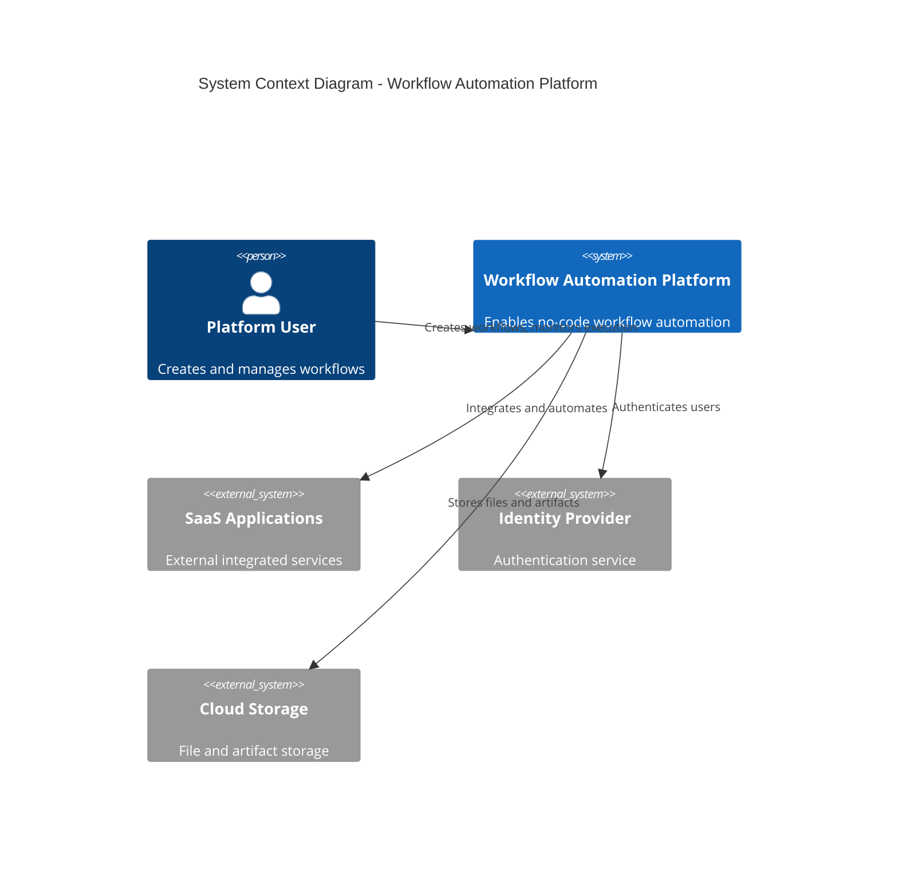
```mermaid
C4Context
    title System Context Diagram - Workflow Automation Platform

    Person(user, "Platform User", "Creates and manages workflows")
    System(wap, "Workflow Automation Platform", "Enables no-code workflow automation")
    System_Ext(saas, "SaaS Applications", "External integrated services")
    System_Ext(idp, "Identity Provider", "Authentication service")
    System_Ext(storage, "Cloud Storage", "File and artifact storage")
    
    Rel(user, wap, "Creates workflows, monitors execution")
    Rel(wap, saas, "Integrates and automates")
    Rel(wap, idp, "Authenticates users")
    Rel(wap, storage, "Stores files and artifacts")
```

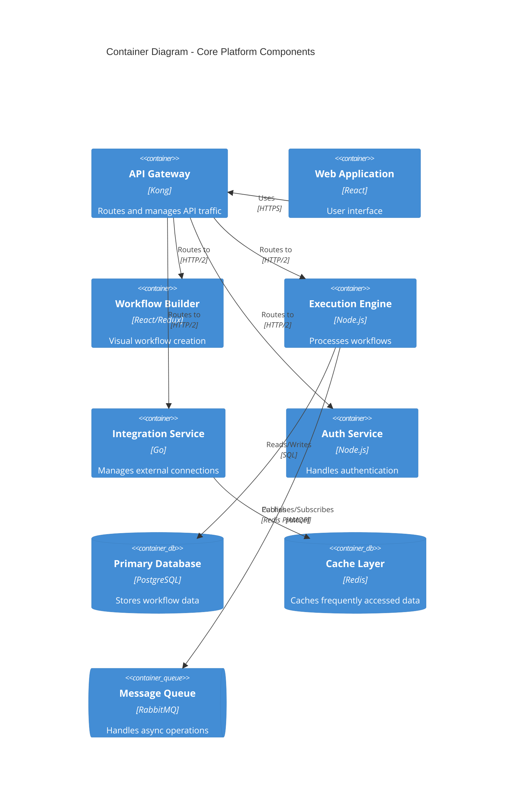
```mermaid
C4Container
    title Container Diagram - Core Platform Components

    Container(api, "API Gateway", "Kong", "Routes and manages API traffic")
    Container(web, "Web Application", "React", "User interface")
    Container(builder, "Workflow Builder", "React/Redux", "Visual workflow creation")
    Container(engine, "Execution Engine", "Node.js", "Processes workflows")
    Container(integration, "Integration Service", "Go", "Manages external connections")
    Container(auth, "Auth Service", "Node.js", "Handles authentication")
    ContainerDb(db, "Primary Database", "PostgreSQL", "Stores workflow data")
    ContainerDb(cache, "Cache Layer", "Redis", "Caches frequently accessed data")
    ContainerQueue(queue, "Message Queue", "RabbitMQ", "Handles async operations")

    Rel(web, api, "Uses", "HTTPS")
    Rel(api, builder, "Routes to", "HTTP/2")
    Rel(api, engine, "Routes to", "HTTP/2")
    Rel(api, integration, "Routes to", "HTTP/2")
    Rel(api, auth, "Routes to", "HTTP/2")
    Rel(engine, queue, "Publishes/Subscribes", "AMQP")
    Rel(engine, db, "Reads/Writes", "SQL")
    Rel(integration, cache, "Caches", "Redis Protocol")
```

## Component Details

### Core Components

| Component | Technology | Purpose | Scaling Strategy |
|-----------|------------|---------|------------------|
| API Gateway | Kong | Traffic management, authentication | Horizontal with load balancing |
| Web Application | React/Next.js | User interface delivery | CDN distribution |
| Workflow Builder | React/Redux | Visual workflow creation | Client-side execution |
| Execution Engine | Node.js | Workflow processing | Horizontal with sharding |
| Integration Service | Go | External service connectivity | Horizontal per service type |
| Auth Service | Node.js | Authentication/authorization | Horizontal with session affinity |

### Data Storage Components

| Component | Technology | Purpose | Scaling Strategy |
|-----------|------------|---------|------------------|
| Primary Database | PostgreSQL | Transactional data | Master-slave replication |
| Document Store | MongoDB | Workflow definitions | Sharding by workspace |
| Cache Layer | Redis | Performance optimization | Cluster mode |
| Message Queue | RabbitMQ | Async communication | Clustered with mirroring |
| Object Storage | S3 | File storage | Native cloud scaling |

## Technical Decisions

### Architecture Patterns

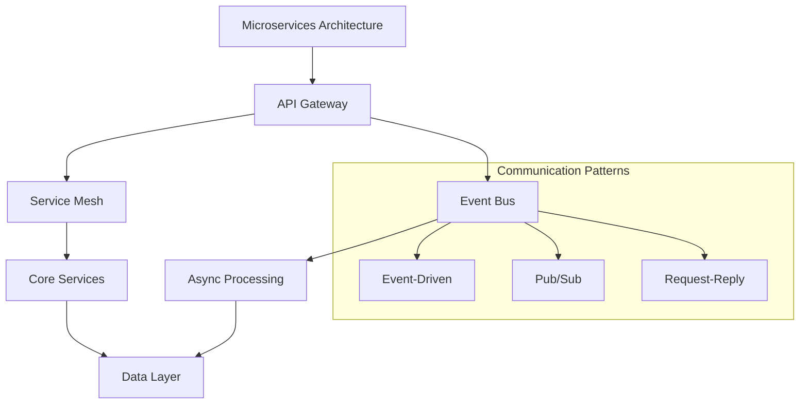
```mermaid
graph TD
    A[Microservices Architecture] --> B[API Gateway]
    B --> C[Service Mesh]
    B --> D[Event Bus]
    
    C --> E[Core Services]
    D --> F[Async Processing]
    
    E --> G[Data Layer]
    F --> G
    
    subgraph "Communication Patterns"
    D --> H[Event-Driven]
    D --> I[Pub/Sub]
    D --> J[Request-Reply]
    end
```

### Data Flow Architecture

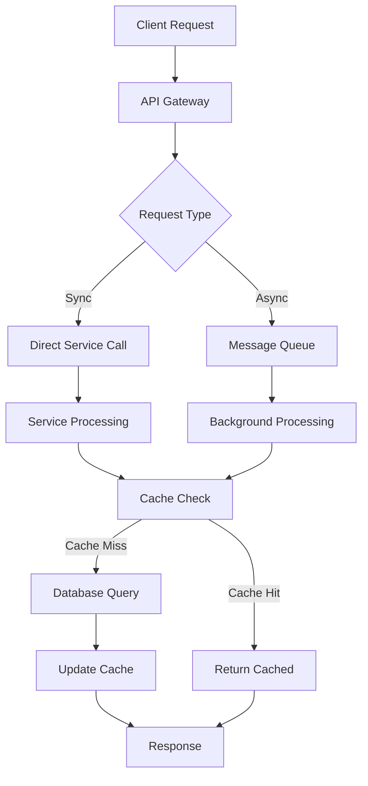
```mermaid
flowchart TD
    A[Client Request] --> B[API Gateway]
    B --> C{Request Type}
    C -->|Sync| D[Direct Service Call]
    C -->|Async| E[Message Queue]
    
    D --> F[Service Processing]
    E --> G[Background Processing]
    
    F --> H[Cache Check]
    G --> H
    
    H -->|Cache Hit| I[Return Cached]
    H -->|Cache Miss| J[Database Query]
    
    J --> K[Update Cache]
    K --> L[Response]
    I --> L
```

## Cross-Cutting Concerns

### Monitoring and Observability

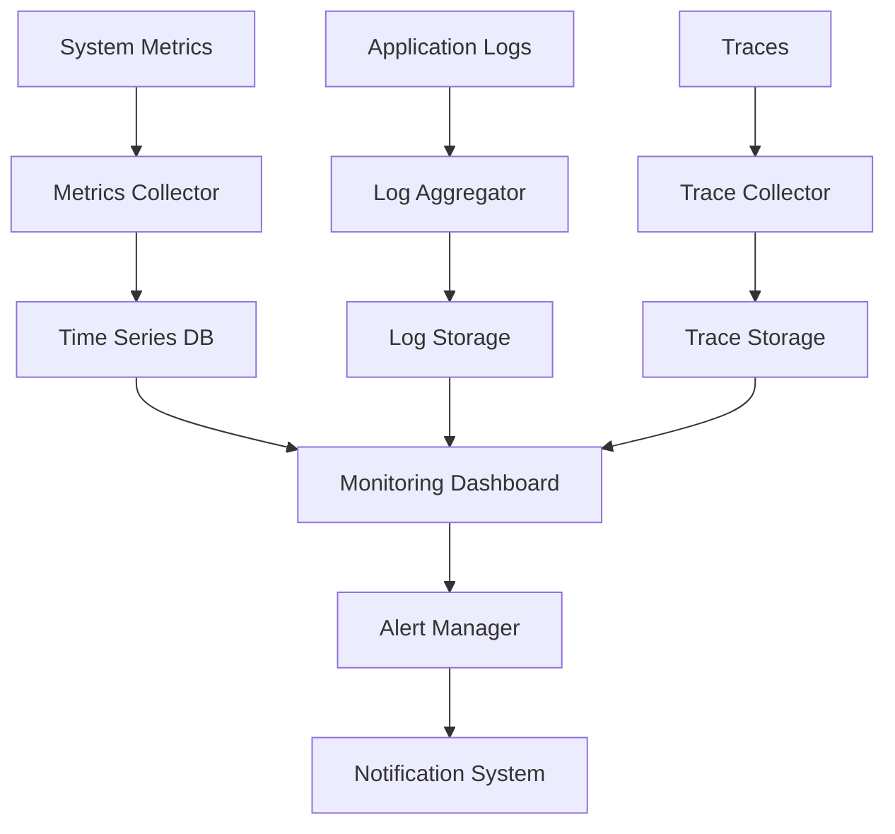
```mermaid
graph TD
    A[System Metrics] --> B[Metrics Collector]
    C[Application Logs] --> D[Log Aggregator]
    E[Traces] --> F[Trace Collector]
    
    B --> G[Time Series DB]
    D --> H[Log Storage]
    F --> I[Trace Storage]
    
    G --> J[Monitoring Dashboard]
    H --> J
    I --> J
    
    J --> K[Alert Manager]
    K --> L[Notification System]
```

### Security Architecture

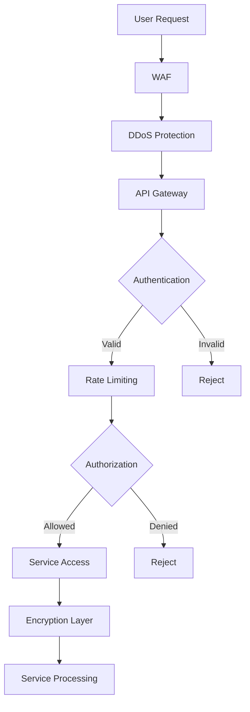
```mermaid
flowchart TD
    A[User Request] --> B[WAF]
    B --> C[DDoS Protection]
    C --> D[API Gateway]
    
    D --> E{Authentication}
    E -->|Valid| F[Rate Limiting]
    E -->|Invalid| G[Reject]
    
    F --> H{Authorization}
    H -->|Allowed| I[Service Access]
    H -->|Denied| J[Reject]
    
    I --> K[Encryption Layer]
    K --> L[Service Processing]
```

### Deployment Architecture

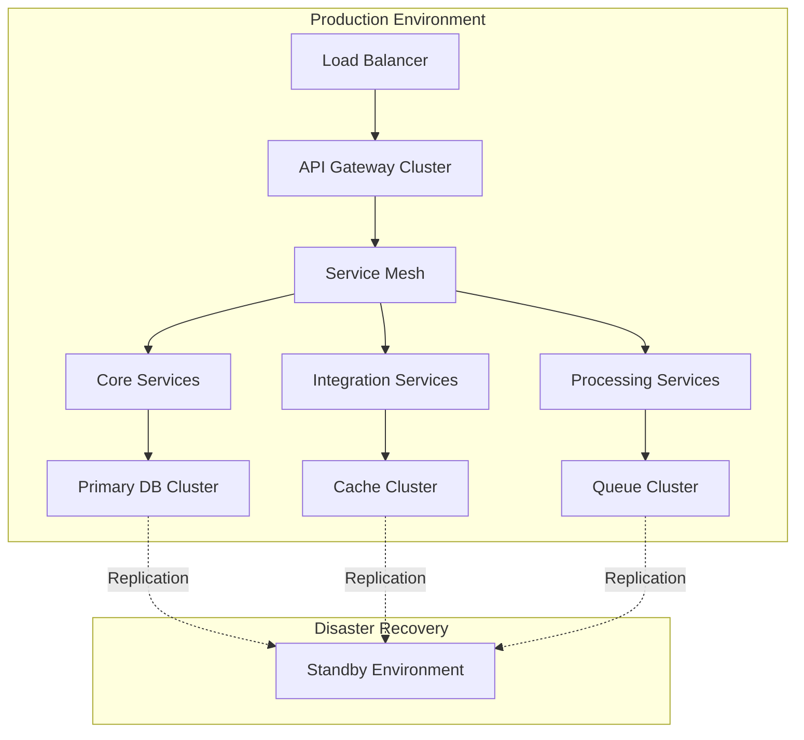
```mermaid
graph TD
    subgraph "Production Environment"
    A[Load Balancer] --> B[API Gateway Cluster]
    B --> C[Service Mesh]
    
    C --> D[Core Services]
    C --> E[Integration Services]
    C --> F[Processing Services]
    
    D --> G[Primary DB Cluster]
    E --> H[Cache Cluster]
    F --> I[Queue Cluster]
    end
    
    subgraph "Disaster Recovery"
    J[Standby Environment]
    end
    
    G -.->|Replication| J
    H -.->|Replication| J
    I -.->|Replication| J
```

# 5. SYSTEM DESIGN

## User Interface Design

### Design System Specifications

| Component | Requirements | Implementation Details |
|-----------|--------------|----------------------|
| Typography | - Primary: Inter<br>- Secondary: Roboto Mono | - Font sizes: 12-32px<br>- Line heights: 1.5-1.8<br>- Weight range: 400-700 |
| Color Palette | - Primary: #2563EB<br>- Secondary: #64748B<br>- Accent: #10B981 | - Light/dark variants<br>- WCAG 2.1 AA compliant<br>- Color-blind friendly |
| Spacing System | - Base unit: 4px<br>- Scale: 4, 8, 16, 24, 32, 48, 64 | - Consistent component spacing<br>- Responsive margins/padding<br>- Grid alignment |
| Components | - Material Design based<br>- Custom workflow components | - Reusable React components<br>- Storybook documentation<br>- Atomic design principles |

### Layout Structure

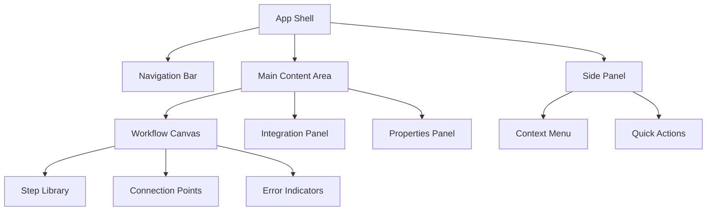
```mermaid
graph TD
    A[App Shell] --> B[Navigation Bar]
    A --> C[Main Content Area]
    A --> D[Side Panel]
    
    C --> E[Workflow Canvas]
    C --> F[Integration Panel]
    C --> G[Properties Panel]
    
    D --> H[Context Menu]
    D --> I[Quick Actions]
    
    E --> J[Step Library]
    E --> K[Connection Points]
    E --> L[Error Indicators]
```

### Critical User Flows

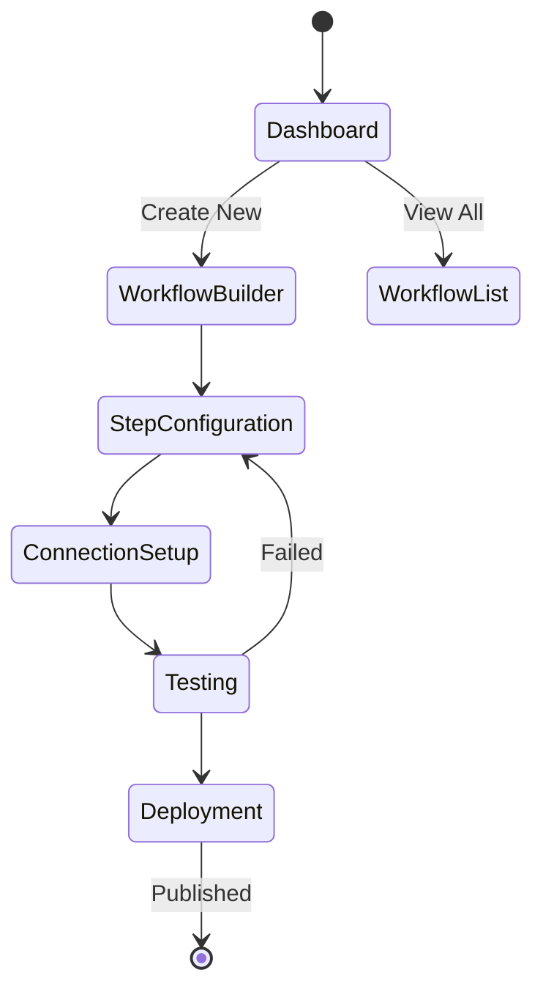
```mermaid
stateDiagram-v2
    [*] --> Dashboard
    Dashboard --> WorkflowBuilder: Create New
    Dashboard --> WorkflowList: View All
    
    WorkflowBuilder --> StepConfiguration
    StepConfiguration --> ConnectionSetup
    ConnectionSetup --> Testing
    
    Testing --> Deployment
    Testing --> StepConfiguration: Failed
    
    Deployment --> [*]: Published
```

### Responsive Breakpoints

| Breakpoint | Width | Layout Adjustments |
|------------|-------|-------------------|
| Mobile | < 768px | Single column, collapsed panels |
| Tablet | 768-1024px | Two column, dynamic panels |
| Desktop | 1024-1440px | Three column, fixed panels |
| Large | > 1440px | Three column, expanded canvas |

## Database Design

### Data Models

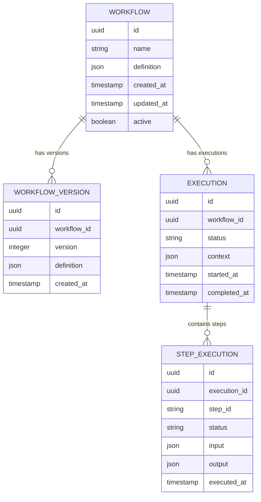
```mermaid
erDiagram
    WORKFLOW {
        uuid id
        string name
        json definition
        timestamp created_at
        timestamp updated_at
        boolean active
    }
    
    WORKFLOW_VERSION {
        uuid id
        uuid workflow_id
        integer version
        json definition
        timestamp created_at
    }
    
    EXECUTION {
        uuid id
        uuid workflow_id
        string status
        json context
        timestamp started_at
        timestamp completed_at
    }
    
    STEP_EXECUTION {
        uuid id
        uuid execution_id
        string step_id
        string status
        json input
        json output
        timestamp executed_at
    }
    
    WORKFLOW ||--o{ WORKFLOW_VERSION : "has versions"
    WORKFLOW ||--o{ EXECUTION : "has executions"
    EXECUTION ||--o{ STEP_EXECUTION : "contains steps"
```

### Indexing Strategy

| Table | Index Type | Columns | Purpose |
|-------|------------|---------|---------|
| workflow | B-tree | (name, created_at) | Search and sorting |
| workflow_version | B-tree | (workflow_id, version) | Version lookup |
| execution | B-tree | (workflow_id, started_at) | Execution history |
| step_execution | Hash | (execution_id) | Step aggregation |

### Partitioning Strategy

| Table | Partition Type | Key | Retention |
|-------|---------------|-----|-----------|
| execution | Range | started_at | 30 days |
| step_execution | Range | executed_at | 30 days |
| workflow_version | List | workflow_id | Indefinite |
| audit_log | Range | timestamp | 90 days |

## API Design

### API Architecture

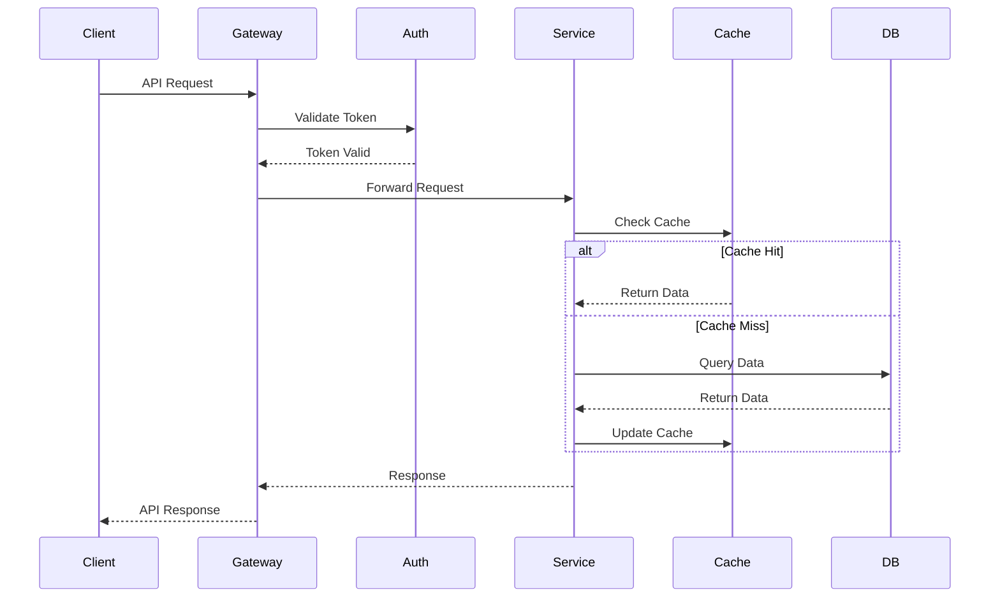
```mermaid
sequenceDiagram
    participant Client
    participant Gateway
    participant Auth
    participant Service
    participant Cache
    participant DB
    
    Client->>Gateway: API Request
    Gateway->>Auth: Validate Token
    Auth-->>Gateway: Token Valid
    Gateway->>Service: Forward Request
    
    Service->>Cache: Check Cache
    alt Cache Hit
        Cache-->>Service: Return Data
    else Cache Miss
        Service->>DB: Query Data
        DB-->>Service: Return Data
        Service->>Cache: Update Cache
    end
    
    Service-->>Gateway: Response
    Gateway-->>Client: API Response
```

### API Endpoints

| Endpoint | Method | Purpose | Authentication |
|----------|--------|---------|----------------|
| /api/v1/workflows | GET, POST | Workflow CRUD | JWT |
| /api/v1/workflows/:id/versions | GET | Version history | JWT |
| /api/v1/executions | GET, POST | Execution management | JWT |
| /api/v1/integrations | GET | Integration catalog | API Key |

### Rate Limiting

| Tier | Rate Limit | Burst Limit | Window |
|------|------------|-------------|---------|
| Free | 1000/hour | 100/minute | Rolling |
| Pro | 10000/hour | 1000/minute | Rolling |
| Enterprise | Custom | Custom | Rolling |

### Error Responses

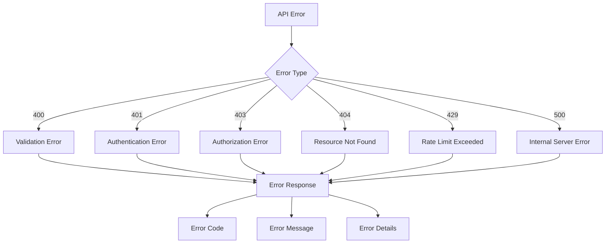
```mermaid
graph TD
    A[API Error] --> B{Error Type}
    B -->|400| C[Validation Error]
    B -->|401| D[Authentication Error]
    B -->|403| E[Authorization Error]
    B -->|404| F[Resource Not Found]
    B -->|429| G[Rate Limit Exceeded]
    B -->|500| H[Internal Server Error]
    
    C --> I[Error Response]
    D --> I
    E --> I
    F --> I
    G --> I
    H --> I
    
    I --> J[Error Code]
    I --> K[Error Message]
    I --> L[Error Details]
```

# 6. TECHNOLOGY STACK

## Programming Languages

| Platform/Component | Language | Version | Justification |
|-------------------|----------|---------|---------------|
| Frontend | TypeScript | 5.0+ | Type safety, developer productivity, robust tooling |
| Backend Core | Node.js | 20 LTS | Event-driven architecture, async processing, extensive ecosystem |
| Integration Service | Go | 1.21+ | High performance, concurrent execution, memory efficiency |
| Data Processing | Python | 3.11+ | Rich data processing libraries, ML capabilities |
| Infrastructure | HCL | 1.5+ | Native Terraform support, infrastructure as code |

## Frameworks & Libraries

### Core Frameworks

| Component | Framework | Version | Purpose |
|-----------|-----------|---------|----------|
| Web Frontend | React | 18.2+ | Component-based architecture, virtual DOM performance |
| UI Framework | Material-UI | 5.14+ | Enterprise-grade components, accessibility compliance |
| API Layer | Express | 4.18+ | Lightweight, flexible routing, middleware support |
| GraphQL | Apollo | 3.8+ | Efficient data fetching, real-time subscriptions |
| Testing | Jest/Cypress | 29+/13+ | Comprehensive testing coverage, CI integration |

### Supporting Libraries

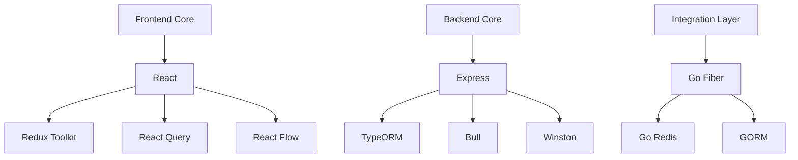
```mermaid
graph TD
    A[Frontend Core] --> B[React]
    B --> C[Redux Toolkit]
    B --> D[React Query]
    B --> E[React Flow]
    
    F[Backend Core] --> G[Express]
    G --> H[TypeORM]
    G --> I[Bull]
    G --> J[Winston]
    
    K[Integration Layer] --> L[Go Fiber]
    L --> M[Go Redis]
    L --> N[GORM]
```

## Databases & Storage

### Primary Databases

| Type | Technology | Version | Use Case |
|------|------------|---------|----------|
| Relational | PostgreSQL | 15+ | Transactional data, user management |
| Document | MongoDB | 6.0+ | Workflow definitions, execution logs |
| Cache | Redis | 7.0+ | Session management, rate limiting |
| Queue | RabbitMQ | 3.12+ | Async processing, event distribution |

### Storage Architecture

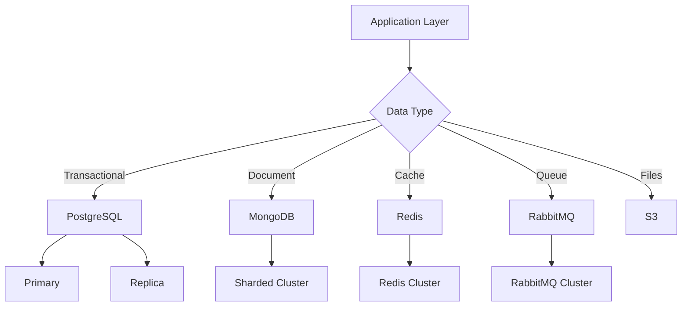
```mermaid
graph TD
    A[Application Layer] --> B{Data Type}
    B -->|Transactional| C[PostgreSQL]
    B -->|Document| D[MongoDB]
    B -->|Cache| E[Redis]
    B -->|Queue| F[RabbitMQ]
    B -->|Files| G[S3]
    
    C --> H[Primary]
    C --> I[Replica]
    
    D --> J[Sharded Cluster]
    E --> K[Redis Cluster]
    F --> L[RabbitMQ Cluster]
```

## Third-Party Services

### Cloud Infrastructure

| Service | Provider | Purpose |
|---------|----------|----------|
| Compute | AWS EKS | Container orchestration |
| Storage | AWS S3 | File storage and CDN |
| CDN | CloudFront | Static asset delivery |
| DNS | Route53 | DNS management |
| Monitoring | DataDog | System monitoring |

### External Services

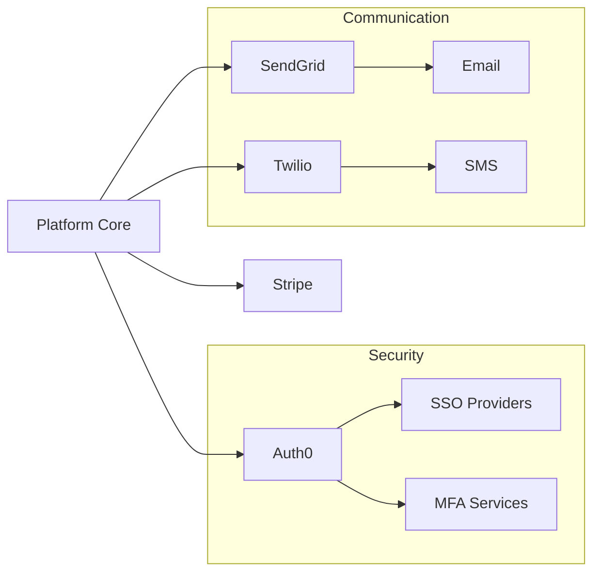
```mermaid
graph LR
    A[Platform Core] --> B[Auth0]
    A --> C[Stripe]
    A --> D[SendGrid]
    A --> E[Twilio]
    
    subgraph Security
    B --> F[SSO Providers]
    B --> G[MFA Services]
    end
    
    subgraph Communication
    D --> H[Email]
    E --> I[SMS]
    end
```

## Development & Deployment

### Development Environment

| Tool | Version | Purpose |
|------|---------|----------|
| VS Code | Latest | Primary IDE |
| Docker | 24+ | Container development |
| Kubernetes | 1.27+ | Local orchestration |
| Git | 2.40+ | Version control |

### CI/CD Pipeline

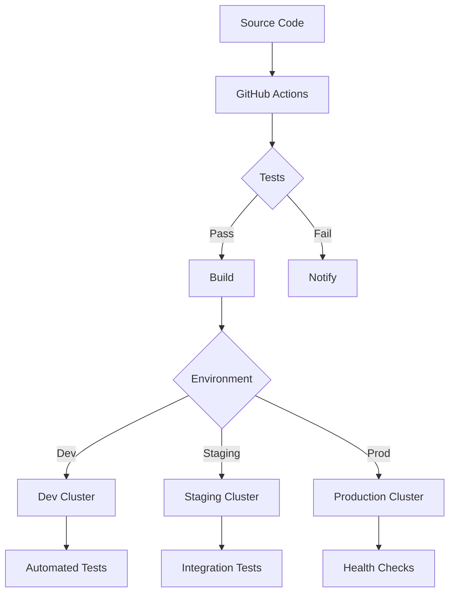
```mermaid
graph TD
    A[Source Code] --> B[GitHub Actions]
    B --> C{Tests}
    C -->|Pass| D[Build]
    C -->|Fail| E[Notify]
    
    D --> F{Environment}
    F -->|Dev| G[Dev Cluster]
    F -->|Staging| H[Staging Cluster]
    F -->|Prod| I[Production Cluster]
    
    G --> J[Automated Tests]
    H --> K[Integration Tests]
    I --> L[Health Checks]
```

### Infrastructure Automation

| Component | Technology | Purpose |
|-----------|------------|----------|
| IaC | Terraform | Infrastructure provisioning |
| Config Management | Ansible | System configuration |
| Secrets | HashiCorp Vault | Secrets management |
| Monitoring | Prometheus/Grafana | Metrics and visualization |

### Deployment Architecture

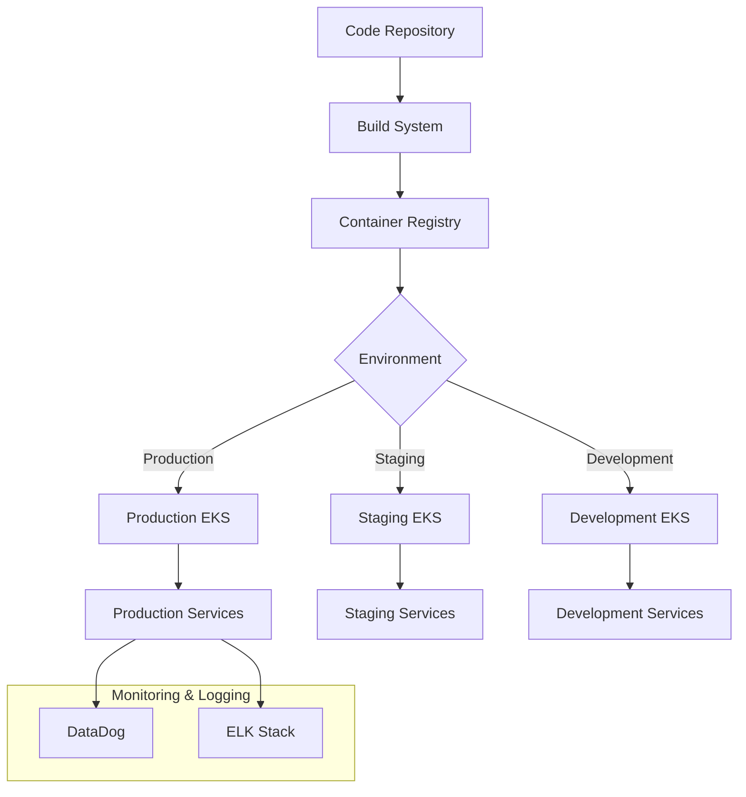
```mermaid
graph TD
    A[Code Repository] --> B[Build System]
    B --> C[Container Registry]
    
    C --> D{Environment}
    D -->|Production| E[Production EKS]
    D -->|Staging| F[Staging EKS]
    D -->|Development| G[Development EKS]
    
    E --> H[Production Services]
    F --> I[Staging Services]
    G --> J[Development Services]
    
    subgraph "Monitoring & Logging"
    K[DataDog]
    L[ELK Stack]
    end
    
    H --> K
    H --> L
```

## User Interface Design

### Design System Specifications

| Component | Requirements | Implementation Details |
|-----------|--------------|----------------------|
| Typography | - Primary: Inter<br>- Secondary: Roboto Mono | - Font sizes: 12-32px<br>- Line heights: 1.5-1.8<br>- Weight range: 400-700 |
| Color Palette | - Primary: #2563EB<br>- Secondary: #64748B<br>- Accent: #10B981 | - Light/dark variants<br>- WCAG 2.1 AA compliant<br>- Color-blind friendly |
| Spacing System | - Base unit: 4px<br>- Scale: 4, 8, 16, 24, 32, 48, 64 | - Consistent component spacing<br>- Responsive margins/padding<br>- Grid alignment |
| Components | - Material Design based<br>- Custom workflow components | - Reusable React components<br>- Storybook documentation<br>- Atomic design principles |

### Layout Structure


```mermaid
graph TD
    A[App Shell] --> B[Navigation Bar]
    A --> C[Main Content Area]
    A --> D[Side Panel]
    
    C --> E[Workflow Canvas]
    C --> F[Integration Panel]
    C --> G[Properties Panel]
    
    D --> H[Context Menu]
    D --> I[Quick Actions]
    
    E --> J[Step Library]
    E --> K[Connection Points]
    E --> L[Error Indicators]
```

### Critical User Flows


```mermaid
stateDiagram-v2
    [*] --> Dashboard
    Dashboard --> WorkflowBuilder: Create New
    Dashboard --> WorkflowList: View All
    
    WorkflowBuilder --> StepConfiguration
    StepConfiguration --> ConnectionSetup
    ConnectionSetup --> Testing
    
    Testing --> Deployment
    Testing --> StepConfiguration: Failed
    
    Deployment --> [*]: Published
```

### Responsive Breakpoints

| Breakpoint | Width | Layout Adjustments |
|------------|-------|-------------------|
| Mobile | < 768px | Single column, collapsed panels |
| Tablet | 768-1024px | Two column, dynamic panels |
| Desktop | 1024-1440px | Three column, fixed panels |
| Large | > 1440px | Three column, expanded canvas |

## Database Design

### Data Models


```mermaid
erDiagram
    WORKFLOW {
        uuid id
        string name
        json definition
        timestamp created_at
        timestamp updated_at
        boolean active
    }
    
    WORKFLOW_VERSION {
        uuid id
        uuid workflow_id
        integer version
        json definition
        timestamp created_at
    }
    
    EXECUTION {
        uuid id
        uuid workflow_id
        string status
        json context
        timestamp started_at
        timestamp completed_at
    }
    
    STEP_EXECUTION {
        uuid id
        uuid execution_id
        string step_id
        string status
        json input
        json output
        timestamp executed_at
    }
    
    WORKFLOW ||--o{ WORKFLOW_VERSION : "has versions"
    WORKFLOW ||--o{ EXECUTION : "has executions"
    EXECUTION ||--o{ STEP_EXECUTION : "contains steps"
```

### Indexing Strategy

| Table | Index Type | Columns | Purpose |
|-------|------------|---------|---------|
| workflow | B-tree | (name, created_at) | Search and sorting |
| workflow_version | B-tree | (workflow_id, version) | Version lookup |
| execution | B-tree | (workflow_id, started_at) | Execution history |
| step_execution | Hash | (execution_id) | Step aggregation |

### Partitioning Strategy

| Table | Partition Type | Key | Retention |
|-------|---------------|-----|-----------|
| execution | Range | started_at | 30 days |
| step_execution | Range | executed_at | 30 days |
| workflow_version | List | workflow_id | Indefinite |
| audit_log | Range | timestamp | 90 days |

## API Design

### API Architecture

```mermaid
sequenceDiagram
    participant Client
    participant Gateway
    participant Auth
    participant Service
    participant Cache
    participant DB
    
    Client->>Gateway: API Request
    Gateway->>Auth: Validate Token
    Auth-->>Gateway: Token Valid
    Gateway->>Service: Forward Request
    
    Service->>Cache: Check Cache
    alt Cache Hit
        Cache-->>Service: Return Data
    else Cache Miss
        Service->>DB: Query Data
        DB-->>Service: Return Data
        Service->>Cache: Update Cache
    end
    
    Service-->>Gateway: Response
    Gateway-->>Client: API Response
```

### API Endpoints

| Endpoint | Method | Purpose | Authentication |
|----------|--------|---------|----------------|
| /api/v1/workflows | GET, POST | Workflow CRUD | JWT |
| /api/v1/workflows/:id/versions | GET | Version history | JWT |
| /api/v1/executions | GET, POST | Execution management | JWT |
| /api/v1/integrations | GET | Integration catalog | API Key |

### Rate Limiting

| Tier | Rate Limit | Burst Limit | Window |
|------|------------|-------------|---------|
| Free | 1000/hour | 100/minute | Rolling |
| Pro | 10000/hour | 1000/minute | Rolling |
| Enterprise | Custom | Custom | Rolling |

### Error Responses

```mermaid
graph TD
    A[API Error] --> B{Error Type}
    B -->|400| C[Validation Error]
    B -->|401| D[Authentication Error]
    B -->|403| E[Authorization Error]
    B -->|404| F[Resource Not Found]
    B -->|429| G[Rate Limit Exceeded]
    B -->|500| H[Internal Server Error]
    
    C --> I[Error Response]
    D --> I
    E --> I
    F --> I
    G --> I
    H --> I
    
    I --> J[Error Code]
    I --> K[Error Message]
    I --> L[Error Details]
```

# USER INTERFACE DESIGN

## Key UI Components & Symbols

| Symbol | Meaning | Usage |
|--------|---------|-------|
| [?] | Help/Info | Contextual help tooltips |
| [$] | Financial | Payment/billing related |
| [i] | Information | Status and details |
| [+] | Add/Create | Create new items |
| [x] | Close/Delete | Remove or close panels |
| [<][>] | Navigation | Move between screens |
| [^] | Upload | File/data upload |
| [#] | Dashboard | Main navigation |
| [@] | User Profile | Account management |
| [!] | Alert/Warning | System notifications |
| [=] | Settings | Configuration options |
| [*] | Favorite | Bookmark/important items |

## Main Dashboard

```
+----------------------------------------------------------+
|  [#] Workflow Automation Platform    [@] Admin  [?] Help   |
+----------------------------------------------------------+
|                                                           |
| [*] Quick Actions        [!] Recent Notifications         |
| +-------------------+   +-----------------------------+    |
| | [+] New Workflow  |   | [!] Workflow "Order Sync"   |    |
| | [^] Import        |   |     failed at 14:23         |    |
| | [=] Settings      |   | [i] 3 workflows need review |    |
| +-------------------+   +-----------------------------+    |
|                                                           |
| Active Workflows                                          |
| +--------------------------------------------------+     |
| | Name          Status    Executions    Last Run    |     |
| | Order Sync    [====]    1.2K/day     2min ago    |     |
| | Lead Router   [====]    350/day      15min ago   |     |
| | Data Backup   [====]    24/day       1hr ago     |     |
| +--------------------------------------------------+     |
|                                                           |
| [Button: View All Workflows]                              |
+----------------------------------------------------------+
```

## Workflow Builder

```
+----------------------------------------------------------+
| [<] Back to Dashboard    Current: Order Sync Workflow     |
+----------------------------------------------------------+
| Tools         |  Canvas                          | Config |
| +----------+ |  +-------------------------+      | +----- |
| |Integration| |  |   Trigger: New Order   |      | |Step  |
| |[+] Steps  | |  |   [Shopify]           |      | |Props |
| |[*] Saved  | |  |          |            |      | |      |
| |           | |  |          v            |      | |      |
| |Categories:| |  |   Process Order       |      | |Name: |
| |[ ] Apps   | |  |   [Custom Logic]      |      | |[...] |
| |[ ] Logic  | |  |          |            |      | |      |
| |[ ] Data   | |  |          v            |      | |Input:|
| |           | |  |   Create Invoice      |      | |[...] |
| |           | |  |   [QuickBooks]        |      | |      |
| +----------+ |  +-------------------------+      | +----- |
|              |                                  |        |
+----------------------------------------------------------+
| [Button: Test] [Button: Save] [Button: Deploy]             |
+----------------------------------------------------------+
```

## Integration Configuration

```
+----------------------------------------------------------+
| Configure Integration: Shopify                             |
+----------------------------------------------------------+
| Authentication                                             |
| +--------------------------------------------------+     |
| | Connection Type: [v] OAuth 2.0                    |     |
| |                                                   |     |
| | Store URL: [..................................]   |     |
| | API Key:   [..................................]   |     |
| | API Secret: [..................................]  |     |
| +--------------------------------------------------+     |
|                                                           |
| Permissions Required                                      |
| +--------------------------------------------------+     |
| | [x] Read Products                                 |     |
| | [x] Write Orders                                 |     |
| | [ ] Manage Customers                             |     |
| | [ ] Manage Inventory                             |     |
| +--------------------------------------------------+     |
|                                                           |
| Rate Limiting                                             |
| +--------------------------------------------------+     |
| | Requests per minute: [v] 250                     |     |
| | Retry attempts:     [v] 3                        |     |
| | Timeout (seconds):  [v] 30                       |     |
| +--------------------------------------------------+     |
|                                                           |
| [Button: Test Connection] [Button: Save Configuration]    |
+----------------------------------------------------------+
```

## Execution Monitor

```
+----------------------------------------------------------+
| Workflow Execution: Order Sync #12345                      |
+----------------------------------------------------------+
| Status: [============================] 75% Complete        |
|                                                           |
| Step Execution                                            |
| +--------------------------------------------------+     |
| | Step              Status     Duration   Data      |     |
| | Trigger          ✓ Success   2ms       [i]       |     |
| | Process Order    ✓ Success   145ms     [i]       |     |
| | Create Invoice   ⟳ Running   --        [i]       |     |
| +--------------------------------------------------+     |
|                                                           |
| Execution Details                                         |
| +--------------------------------------------------+     |
| | Started: 2024-02-20 14:23:45 UTC                 |     |
| | Duration: 147ms (running)                        |     |
| | Memory: 256MB                                    |     |
| | CPU: 0.2 cores                                   |     |
| +--------------------------------------------------+     |
|                                                           |
| [Button: Pause] [Button: Stop] [Button: View Logs]        |
+----------------------------------------------------------+
```

## Analytics Dashboard

```
+----------------------------------------------------------+
| Workflow Analytics                    Period: [v] Last 7d  |
+----------------------------------------------------------+
| Summary                         |  Execution Trend         |
| +-------------------------+     |  +------------------+    |
| | Total Executions: 8.2K |     |  |    /-\          |    |
| | Success Rate: 99.2%    |     |  |   /   \  /-\    |    |
| | Avg Duration: 1.2s     |     |  | -/     \/   \-  |    |
| +-------------------------+     |  +------------------+    |
|                                |  M  T  W  T  F  S  S    |
| Top Workflows                  |                          |
| +--------------------------------------------------+     |
| | Name          Executions  Errors  Avg Time        |     |
| | Order Sync    5.2K        12      0.8s           |     |
| | Lead Router   2.1K        5       1.5s           |     |
| | Data Backup   0.9K        0       2.3s           |     |
| +--------------------------------------------------+     |
|                                                           |
| [Button: Export Report] [Button: Configure Alerts]        |
+----------------------------------------------------------+
```

## Error Management Console

```
+----------------------------------------------------------+
| Error Management                 Severity: [v] All         |
+----------------------------------------------------------+
| Active Errors                                             |
| +--------------------------------------------------+     |
| | Time     Workflow        Error           Status   |     |
| | 14:23:45 Order Sync     API Timeout     [Retry]  |     |
| | 14:20:12 Lead Router    Auth Failed     [Debug]  |     |
| | 14:15:33 Data Backup    Rate Limited    [Pause]  |     |
| +--------------------------------------------------+     |
|                                                           |
| Error Details                                            |
| +--------------------------------------------------+     |
| | Error ID: ERR-2024-02-20-001                     |     |
| | Type: API Timeout                                 |     |
| | Message: Shopify API failed to respond            |     |
| | Stack Trace: [Button: Expand]                     |     |
| | Affected Steps: Order Processing                  |     |
| +--------------------------------------------------+     |
|                                                           |
| [Button: Retry All] [Button: Export Logs]                |
+----------------------------------------------------------+
```

## Responsive Design Breakpoints

| Breakpoint | Layout Changes |
|------------|---------------|
| Mobile (<768px) | - Single column layout<br>- Collapsed navigation<br>- Simplified workflow canvas<br>- Touch-optimized controls |
| Tablet (768-1024px) | - Two column layout<br>- Side panel overlays<br>- Compact workflow canvas<br>- Touch/mouse controls |
| Desktop (1024-1440px) | - Three column layout<br>- Persistent side panels<br>- Full workflow canvas<br>- Mouse-optimized controls |
| Large (>1440px) | - Three column layout<br>- Expanded canvas area<br>- Multiple workflow views<br>- Advanced controls visible |

# SECURITY CONSIDERATIONS

## AUTHENTICATION AND AUTHORIZATION

### Authentication Methods

| Method | Implementation | Use Case |
|--------|----------------|----------|
| OAuth 2.0 | Auth0/Okta integration | SSO and social login |
| JWT | RS256 signed tokens | API authentication |
| SAML 2.0 | Enterprise IdP integration | Enterprise SSO |
| API Keys | SHA-256 hashed | Integration authentication |
| MFA | TOTP/SMS/Hardware keys | Admin and sensitive operations |

### Authorization Model

```mermaid
graph TD
    A[User Request] --> B{Authentication}
    B -->|Valid| C{Role Check}
    B -->|Invalid| D[Deny Access]
    
    C -->|Authorized| E{Permission Check}
    C -->|Unauthorized| D
    
    E -->|Granted| F[Allow Access]
    E -->|Denied| D
    
    subgraph "RBAC Model"
    G[User] -->|belongs to| H[Role]
    H -->|has| I[Permissions]
    I -->|controls| J[Resources]
    end
```

### Role-Based Access Control Matrix

| Role | Workflow Management | Integration Config | User Management | System Settings |
|------|-------------------|-------------------|-----------------|-----------------|
| Admin | Full Access | Full Access | Full Access | Full Access |
| Manager | Create/Edit/Delete | Create/Edit | View Only | No Access |
| Developer | Create/Edit | Create/Edit | No Access | No Access |
| Analyst | View Only | View Only | No Access | No Access |

## DATA SECURITY

### Encryption Standards

| Layer | Method | Key Management |
|-------|---------|---------------|
| Data at Rest | AES-256-GCM | AWS KMS |
| Data in Transit | TLS 1.3 | Automated cert rotation |
| Field-level | AES-256-CBC | HashiCorp Vault |
| Backup Data | AES-256-GCM | Multi-region key storage |

### Data Classification

```mermaid
flowchart TD
    A[Input Data] --> B{Classification}
    B -->|PII| C[Encryption Required]
    B -->|Sensitive| D[Restricted Access]
    B -->|Internal| E[Standard Protection]
    B -->|Public| F[Basic Protection]
    
    C --> G[Field-level Encryption]
    D --> H[Access Controls]
    E --> I[Standard Security]
    F --> J[Public Access]
```

### Data Protection Measures

| Data Type | Protection Method | Access Control | Monitoring |
|-----------|------------------|----------------|------------|
| Credentials | Vault encrypted | Admin only | Real-time alerts |
| PII | Field-level encryption | Role-based | Daily audits |
| Workflow Data | TLS encryption | Owner/shared | Weekly reviews |
| System Logs | Encrypted storage | System only | Monthly audits |

## SECURITY PROTOCOLS

### Network Security

```mermaid
flowchart LR
    A[Internet] --> B[WAF]
    B --> C[DDoS Protection]
    C --> D[Load Balancer]
    D --> E[API Gateway]
    
    E --> F[Application Layer]
    F --> G[Service Mesh]
    
    subgraph Security Controls
    H[IDS/IPS]
    I[Network Monitoring]
    J[Vulnerability Scanning]
    end
```

### Security Monitoring

| Component | Monitoring Method | Alert Threshold | Response Time |
|-----------|------------------|-----------------|---------------|
| API Gateway | Real-time metrics | 100 failed auth/min | 5 minutes |
| Network | IDS/IPS | Suspicious patterns | Immediate |
| Database | Query monitoring | Unusual access patterns | 15 minutes |
| Applications | Log analysis | Error rate > 5% | 10 minutes |

### Security Compliance

| Standard | Implementation | Validation |
|----------|---------------|------------|
| SOC 2 Type II | Continuous monitoring | Annual audit |
| GDPR | Data protection measures | Quarterly review |
| ISO 27001 | Security controls | Annual certification |
| PCI DSS | Card data security | Quarterly scan |

### Incident Response

```mermaid
stateDiagram-v2
    [*] --> Detection
    Detection --> Analysis
    Analysis --> Containment
    Containment --> Eradication
    Eradication --> Recovery
    Recovery --> PostIncident
    PostIncident --> [*]
    
    Analysis --> Escalation
    Escalation --> Containment
```

### Security Testing

| Test Type | Frequency | Coverage | Tools |
|-----------|-----------|----------|-------|
| Penetration Testing | Quarterly | External/Internal | Burp Suite, Metasploit |
| Vulnerability Scanning | Weekly | All systems | Nessus, Qualys |
| Security Audits | Monthly | Access controls | Custom tooling |
| Code Analysis | Continuous | All code | SonarQube, Snyk |

# 7. INFRASTRUCTURE

## Deployment Environment

| Environment | Purpose | Configuration | Scaling Strategy |
|------------|---------|---------------|------------------|
| Production | Live customer workloads | Multi-region active-active | Horizontal auto-scaling |
| Staging | Pre-production testing | Single region, production mirror | Manual scaling |
| QA | Testing and validation | Reduced capacity replica | Fixed resources |
| Development | Feature development | Minimal infrastructure | On-demand |

### Regional Distribution

```mermaid
graph TB
    subgraph "Primary Region - US East"
    A[Load Balancer] --> B[API Gateway Cluster]
    B --> C[Service Mesh]
    C --> D[Core Services]
    C --> E[Integration Services]
    D --> F[Primary DB]
    E --> G[Cache Cluster]
    end
    
    subgraph "Secondary Region - EU West"
    H[Load Balancer] --> I[API Gateway Cluster]
    I --> J[Service Mesh]
    J --> K[Core Services]
    J --> L[Integration Services]
    K --> M[Secondary DB]
    L --> N[Cache Cluster]
    end
    
    F -.->|Replication| M
    G -.->|Replication| N
```

## Cloud Services

| Service Category | AWS Service | Purpose | Configuration |
|-----------------|-------------|---------|---------------|
| Compute | EKS | Container orchestration | Production: r6g.xlarge<br>Staging: r6g.large |
| Database | Aurora PostgreSQL | Primary data store | Multi-AZ, Auto-scaling |
| Cache | ElastiCache | In-memory caching | Redis cluster mode |
| Message Queue | Amazon MQ | Event processing | RabbitMQ with mirroring |
| Storage | S3 | File storage | Cross-region replication |
| CDN | CloudFront | Static asset delivery | Global edge locations |
| DNS | Route 53 | DNS management | Active-active failover |
| Security | AWS Shield | DDoS protection | Advanced protection |

## Containerization

### Container Architecture

```mermaid
graph TD
    A[Base Image] --> B[Node.js Runtime]
    A --> C[Go Runtime]
    
    B --> D[API Services]
    B --> E[Worker Services]
    C --> F[Integration Services]
    
    D --> G[Production Image]
    E --> G
    F --> G
    
    subgraph "Container Security"
    H[Vulnerability Scanning]
    I[Image Signing]
    J[Policy Enforcement]
    end
    
    G --> H
    H --> I
    I --> J
```

### Container Specifications

| Component | Base Image | Resource Limits | Scaling Policy |
|-----------|------------|-----------------|----------------|
| API Services | node:20-alpine | CPU: 2, Memory: 4Gi | CPU > 70% |
| Worker Services | node:20-alpine | CPU: 4, Memory: 8Gi | Queue length |
| Integration Services | golang:1.21-alpine | CPU: 2, Memory: 4Gi | Request count |
| Cron Jobs | node:20-alpine | CPU: 1, Memory: 2Gi | Schedule based |

## Orchestration

### Kubernetes Architecture

```mermaid
graph TD
    A[Ingress Controller] --> B[API Gateway]
    B --> C[Service Mesh]
    
    C --> D[API Pods]
    C --> E[Worker Pods]
    C --> F[Integration Pods]
    
    subgraph "Platform Services"
    G[Monitoring]
    H[Logging]
    I[Security]
    end
    
    D --> G
    E --> G
    F --> G
    
    D --> H
    E --> H
    F --> H
    
    D --> I
    E --> I
    F --> I
```

### Cluster Configuration

| Component | Configuration | High Availability | Scaling |
|-----------|--------------|-------------------|----------|
| Control Plane | Multi-master | 3 masters per region | N/A |
| Worker Nodes | EC2 r6g.2xlarge | Min 3 per AZ | Auto-scaling |
| Ingress | NGINX | 2 replicas per AZ | Manual |
| Service Mesh | Istio | Highly available | Auto |

## CI/CD Pipeline

### Pipeline Architecture

```mermaid
graph LR
    A[Source Code] --> B[Build]
    B --> C[Test]
    C --> D[Security Scan]
    D --> E[Package]
    E --> F{Environment}
    
    F -->|Dev| G[Dev Deploy]
    F -->|Staging| H[Stage Deploy]
    F -->|Prod| I[Production Deploy]
    
    G --> J[Dev Tests]
    H --> K[Integration Tests]
    I --> L[Health Checks]
    
    J --> M[Metrics]
    K --> M
    L --> M
```

### Pipeline Stages

| Stage | Tools | Success Criteria | Rollback Strategy |
|-------|-------|-----------------|-------------------|
| Build | GitHub Actions | All builds pass | N/A |
| Test | Jest, Cypress | 100% pass, 80% coverage | N/A |
| Security | Snyk, SonarQube | No high vulnerabilities | N/A |
| Deploy Dev | ArgoCD | Health checks pass | Automatic |
| Deploy Staging | ArgoCD | Integration tests pass | Automatic |
| Deploy Prod | ArgoCD | Canary metrics pass | Automated rollback |

### Deployment Strategy

```mermaid
graph TD
    A[New Version] --> B{Deployment Type}
    B -->|Staging| C[Blue/Green]
    B -->|Production| D[Canary]
    
    C --> E[Full Staging Deploy]
    E --> F[Integration Tests]
    F -->|Pass| G[Switch Traffic]
    F -->|Fail| H[Rollback]
    
    D --> I[5% Traffic]
    I --> J[Monitor Metrics]
    J -->|Good| K[Gradual Increase]
    J -->|Bad| L[Rollback]
    
    K --> M[100% Traffic]
```

# APPENDICES

## ADDITIONAL TECHNICAL INFORMATION

### Workflow Engine Internals

```mermaid
graph TD
    A[Workflow Definition] --> B[Parser]
    B --> C[Validator]
    C --> D[Optimizer]
    D --> E[Execution Plan]
    
    E --> F{Execution Type}
    F -->|Synchronous| G[Direct Execution]
    F -->|Asynchronous| H[Queue Processing]
    
    G --> I[Result Handler]
    H --> J[Worker Pool]
    J --> I
    
    I --> K[State Management]
    K --> L[Persistence Layer]
```

### Integration Protocol Support Matrix

| Protocol | Version | Security | Use Cases |
|----------|---------|----------|-----------|
| REST | HTTP/1.1, HTTP/2 | TLS 1.3, mTLS | General API integration |
| GraphQL | June 2018+ | TLS 1.3, JWT | Complex data queries |
| gRPC | v1.30+ | TLS 1.3, mTLS | High-performance microservices |
| WebSocket | RFC 6455 | TLS 1.3, JWT | Real-time data streams |
| MQTT | v5.0 | TLS 1.3, SASL | IoT device integration |
| AMQP | v1.0 | TLS 1.3, SASL | Message queue integration |

### Error Classification System

| Error Category | HTTP Code Range | Retry Strategy | Alert Priority |
|----------------|-----------------|----------------|----------------|
| Authentication | 401, 403 | No retry | High |
| Rate Limiting | 429 | Exponential backoff | Medium |
| Integration | 502, 503, 504 | Circuit breaker | High |
| Validation | 400, 422 | No retry | Low |
| System | 500 | Linear backoff | Critical |

## GLOSSARY

| Term | Definition |
|------|------------|
| Asynchronous Processing | Execution model where operations run independently of the main request flow |
| Circuit Breaker | Design pattern that prevents cascading failures by stopping operations when error thresholds are exceeded |
| Data Mapping | Process of defining relationships between different data models for transformation |
| Execution Context | Runtime environment containing workflow state and variables |
| Idempotency | Property ensuring multiple identical requests produce the same result |
| Integration Connector | Pre-built component enabling connection to specific external services |
| Polling Interval | Time period between consecutive checks for new data in external systems |
| Rate Limiting | Control mechanism restricting the frequency of API requests |
| Step Template | Reusable workflow component with predefined configuration |
| Webhook | HTTP callback triggered by specific events in external systems |

## ACRONYMS

| Acronym | Full Form |
|---------|-----------|
| AMQP | Advanced Message Queuing Protocol |
| CDN | Content Delivery Network |
| CORS | Cross-Origin Resource Sharing |
| DDoS | Distributed Denial of Service |
| ELK | Elasticsearch, Logstash, Kibana |
| GDPR | General Data Protection Regulation |
| HSM | Hardware Security Module |
| OIDC | OpenID Connect |
| RBAC | Role-Based Access Control |
| RPO | Recovery Point Objective |
| RTO | Recovery Time Objective |
| SAML | Security Assertion Markup Language |
| SOC | System and Organization Controls |
| SSO | Single Sign-On |
| TLS | Transport Layer Security |
| WAF | Web Application Firewall |
| WCAG | Web Content Accessibility Guidelines |
| XSS | Cross-Site Scripting |

## REFERENCE ARCHITECTURE

```mermaid
graph TD
    subgraph "Frontend Layer"
    A[Web Application]
    B[API Gateway]
    end
    
    subgraph "Service Layer"
    C[Workflow Service]
    D[Integration Service]
    E[Execution Service]
    F[Analytics Service]
    end
    
    subgraph "Data Layer"
    G[PostgreSQL]
    H[MongoDB]
    I[Redis]
    J[RabbitMQ]
    end
    
    A --> B
    B --> C
    B --> D
    B --> E
    B --> F
    
    C --> G
    C --> H
    D --> I
    E --> J
    F --> G
```

## COMPLIANCE MATRIX

| Requirement | Standard | Implementation | Validation |
|------------|----------|----------------|------------|
| Data Encryption | NIST FIPS 140-2 | AES-256-GCM | Annual audit |
| Access Control | ISO 27001 | RBAC + MFA | Quarterly review |
| Audit Logging | SOC 2 Type II | ELK Stack | Continuous monitoring |
| Data Privacy | GDPR | Data classification + encryption | Annual assessment |
| Availability | SLA 99.99% | Multi-region deployment | Real-time monitoring |
| Disaster Recovery | ISO 22301 | Cross-region replication | Quarterly testing |